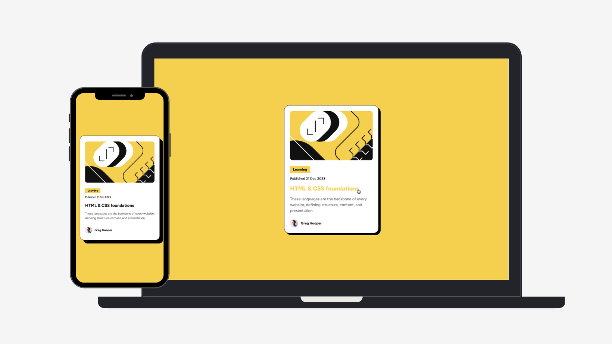

# Frontend Mentor - Blog preview card solution

This is a solution to the [Blog preview card challenge on Frontend Mentor](https://www.frontendmentor.io/challenges/blog-preview-card-ckPaj01IcS). Frontend Mentor challenges help you improve your coding skills by building realistic projects. 

## Table of contents

- [Overview](#overview)
  - [The challenge](#the-challenge)
  - [Screenshot](#screenshot)
  - [Links](#links)
- [My process](#my-process)
  - [Built with](#built-with)
  - [What I learned](#what-i-learned)
  - [Continued development](#continued-development)
  - [Useful resources](#useful-resources)
- [Author](#author)

## Overview

### The challenge

Users should be able to:

- See a beautifully designed blog preview card
- View hover and focus states for interactive elements
- Experience a responsive layout that adapts to different screen sizes
- See proper semantic HTML structure

### Screenshot



### Links

- Solution URL: [Solution URL here](https://jucroizer.github.io/blog_preview_card_project/)

## My process

### Built with

- Semantic HTML5 markup
- CSS custom properties (variables)
- Flexbox for layout
- Mobile-first workflow
- Responsive typography with modern CSS units

### What I learned

Working on this project helped me understand:

- **Semantic HTML**: Using `<article>`, `<figure>`, and proper heading hierarchy
- **CSS custom properties**: Managing colors and reusable values with `--variables` and using `clamp()` for responsive font sizes
- **Flexbox**: Creating flexible card layouts that adapt to content
- **Responsive design**: Building components that look good on all screen sizes
- **Box model**: Understanding padding, margins, borders, and shadows for depth

```html
<article class="card">
  <figure class="card-thumbnail">
    
  </figure>
</article>
```

```css
:root {
  --bg: #F4D04E;
  --text: #111111;
  --gray: #6B6B6B;
}

.card {
  background: var(--white);
  border: 1px solid var(--text);
  padding: 24px;
  box-shadow: 16px 16px 0 var(--black);
  display: flex;
  flex-direction: column;
  gap: 24px;
}

.card-title {
  font-size: clamp(1.25rem, 2.5vw, 1.5rem);
  font-weight: 700;
  color: var(--text);
  margin-bottom: 1rem;
  margin-top: 0.5rem;
}
```

### Continued development

Areas I want to improve in future projects:

- Advanced CSS animations and transitions
- Improving performance with optimized images
- Accessibility best practices, including ARIA roles and keyboard navigation
- Responsive design techniques for complex layouts

### Useful resources

- [MDN Web Docs - Flexbox](https://developer.mozilla.org/en-US/docs/Web/CSS/CSS_Flexible_Box_Layout) - Essential for understanding flexible layouts
- [CSS-Tricks - A Complete Guide to Flexbox](https://css-tricks.com/snippets/css/a-guide-to-flexbox/) - Great visual guide with examples
- [Frontend Mentor - Learning Paths](https://www.frontendmentor.io/learning-paths) - Structured learning resources

## Author

- Frontend Mentor - [@jucroizer](https://www.frontendmentor.io/profile/jucroizer)